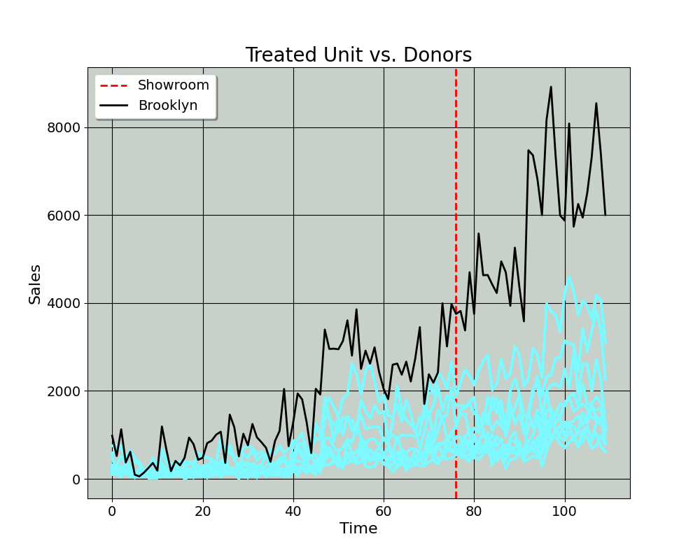

Paso Doble: A Tutorial on the [Two-Step](https://doi.org/10.1287/mnsc.2023.4878) Synthetic Control Method 
==============

**Author:** *Jared Greathouse*

> **Note**
>
> This is an ongoing project; any feedback or comments are most welcome! In particular, someday I will add in the confidence intervals as well as do deeper explication of the subsampling routine for method selection.

# Introduction
This tutorial uses publicly available data to demonstrate the utility of the [Two-Step](https://doi.org/10.1287/mnsc.2023.4878) Synthetic Control Method (TSSCM). The Python code is based on MATLAB code by [Kathleen Li](https://sites.utexas.edu/kathleenli/). The tutorial is also intended to give social scientists a more precise idea of the parallel trends assumptions underlying difference-in-differences (DID) and SCM, as these designs are increasingly popular for policy analysts, economists, marketers, and other fields. As a sort of prerequisite, I presumse that the reader is familiar with the basics of causal inference as well as the estimation of these designs. I begin with the mathematical preliminaries:
# Model Primitives
Here, we have $\mathcal{N} \coloneqq \lbrace{1 \ldots N \rbrace}$ units across $t \in \left(1, T\right) \cap \mathbb{N}$ time periods, where $j=1$ is our sole treated unit. This leaves us with $\mathcal{N}\_{0} \coloneqq \lbrace{2 \ldots N\rbrace}$ control units, with the cardinality of this set being the number of controls. We have two sets of time series $\mathcal{T}\coloneqq \mathcal{T}\_{0} \cup \mathcal{T}\_{1}$, where $\mathcal{T}\_{0}\coloneqq  \lbrace{1\ldots T_0 \rbrace}$ is the pre-intervention period and $\mathcal{T}\_{1}\coloneqq \lbrace{T_0+1\ldots T \rbrace}$ denotes the post-intervention period, each with their respective cardinalities. Let $\mathbf{w} \coloneqq \lbrace{w_2 \ldots w\_N  \rbrace}$ be a generic weight vector we assign to untreated units. We observe
```math
\begin{equation*}
y_{jt} = 
\begin{cases}
    y^{0}_{jt} & \forall \: j\in \mathcal{N}_0\\
    y^{0}_{1t} & \text{if } j = 1 \text{ and } t \in \mathcal{T}_0 \\
    y^{1}_{1t} & \text{if } j = 1 \text{ and } t \in \mathcal{T}_1
\end{cases}

\end{equation*}
```
We have a single treated unit which, along with the donors, follows a certain data generating process for all time periods until $T_0$. Afterwards, the control units follow the same process. The change of the outcomes $j=1,  \forall t \in \mathcal{T}_1$ is whatever that process was, plus some treatment effect.  To this end, we are concerned with $\hat{y}\_{j1}$, or the values we would have observed absent treatment. The statistic we are concerned with is the average treatment effect on the treated

$$ ATT = \frac{1}{T\_1 - T\_0} \sum_{T\_0 +1}^{T} (y_{1t} - \hat{y}_{1t}) $$

where $(y_{1t} - \hat{y}_{1t})$ is the treatment effect. Next, we can think about how to model this.

Consider $$\mathbf{M}^{\ast}\_{jt} = \sum\_{k=1}^{r} \boldsymbol{\lambda}\_{jk}\boldsymbol{\gamma}\_{tk},$$ a model known as a factor model in the econometrics literature. The DID method assumes the outcomes we observe are byproduct of a time specific effect and a unit specific effect, $\mathbf{M}^{\ast}\_{jt} = a_j + b_t$. This means, from the above, that $r=2$ and $\boldsymbol{\lambda}\_{j1}=a_j, \boldsymbol{\lambda}\_{j2}=1, \boldsymbol{\gamma}\_{t1}=1, \boldsymbol{\gamma}\_{t2}=b_t$. This means we may use the average of controls as a proxy for the unit-specific coefficient (in the pre and post period). The time-specific coefficient must be estimated. Accordingly, think about DID as a weighting estimator which solves
```math
\begin{align}
    (\hat{\mu},\hat{w}) = \underset{\mu,w}{\text{arg\,min}} & \quad (\mathbf{y}_{1} - \mu -\mathbf{w}^\top -\mathbf{Y}_{\mathcal{N}_{0}})^\top (\mathbf{y}_{1} - \mu -\mathbf{w}^\top -\mathbf{Y}_{\mathcal{N}_{0}}) \\
    \text{s.t.} & \quad \mathbf{w}= N^{-1}_{0} \\
    & \mu = \frac{1}{T_0}\sum_{t=1}^{T_0}y_{1t} - \frac{1}{N_{0} \cdot T_0} \sum_{t=1}^{T_0}\sum_{j=2}^{N_0}y_{j \in \mathcal{N}_{0}.}
\end{align}
```
Here, we seek the line that minimizes the differences between the treated vector $\mathbf{y}\_{1}$ and the weighted average of controls $\mathbf{w}^\top -\mathbf{Y}\_{\mathcal{N}_{0}}$, subject to the weights being proportional to the inverse of the cardinality of the donor set, $\mathbf{w}= N^{-1}\_{0}$. We don't typically think of DID as a weighting estimator, but this makes sense; in our intro to causal inference courses, we learn that DID posits that our counterfactual for the treated unit would be the pure average of our control units plus some intercept, $\mu$. Well, the only way we may have this is if we are implicitly giving every control unit as much as weight as all of the other control units. Any imbalance in the preintervention period comes from poor control units or omitted variable biases. This means that for objective causal inference in DID, we must compare the treated unit to a set of controls that are as similar to the treated unit in every way but for the treatment. This leaves analysts with a few paths to take: we either discard dissimilar donors, or we adjust the weighting scheme for our units. As I've mentioned [elsewhere](https://github.com/jgreathouse9/FDIDTutorial/blob/main/Vignette.md), we may use methods such as forward selection to obtain the correct donor pool, under certain instances. In the case of DID, we may discard units.

SCM however has a different weighting scheme. In the SCM world, one of the primary innovations is that we are explicitly saying that the weights are not meant to be constant. Generically, we may express classic SCM as
```math
\begin{align}
    \underset{w}{\text{argmin}} & \quad ||\mathbf{y}_{1} - \mathbf{Y}_{\mathcal{N}_{0}}w_j||_{2}^2 \\
    \text{s.t.} & \mathbf{w}: w_{j} \in \mathbb{I} \quad  {\| \mathbf{w} \|_{1} = 1}
\end{align}
```
Where $\mathbb{I}$ is the unit interval. Much as above, the unit weights must also add up to 1. However in SCM, the weights may vary. This makes sense: SCM simply asks us to assume that some units matter more than others, and that in doing so (in absence of an intercept), our counterfactual would be the weighted average of controls. We use convex hull constraints to build our synthetic control.
## Interlude: Convex Hulls and Intercepts

> **Note**
>
> The idea of summation constraints and convex hulls has **direct implications** for the Two-Step Method. I pause here to give it a more extended discussion.
>
> 
Before I continue, I will be as precise as possible about what the convex hull means in the context of. Oftentimes it is invoked by researchers using SCM, but it rarely explained in the simplest possible terms (or at least, it sure was never explained like this in my three causal inference courses. Intuition for this is critical to understanding how the convex hull's relaxation implies for estimation. To begin, let's consider the geometric definition

```math
\text{conv}(\mathcal U) = \left\{ \sum_{j=1}^n w_j \mathbf{y}_j : n \in \mathbb{N}, \, \mathbf{y}_j \in \mathcal U \text{ and } w_j \in \mathbb{R}_{> 0} \text{ for each } j, \, \sum_{j=1}^n w_j = 1 \right\}.

```
Here, $\mathcal U$ represents the collection of 43 points for both vectors. As above, $w$ is a scalar that forms the linear combination with outcome columns vectors $\mathbf y$ and $n$ is a finite integer representing the number of vectors we have. The convex hull is the smallest possible convex set that wraps around a set of points. But what really does this mean anyways, and why do we care? Let's think about the very first SCM paper which studies the impact of terrorism on GDP in the Basque Country.

<p align="center">
  
</p>

Here I plot the GDP per Capita of the Spanish states from 1955 to 1997. The blue reference line denotes the onset of terrorist attacks in the Basque Country in 1975. Suppose we wish to use DID to construct the counterfactual GDP trends of the Basque Country. We will simply add an intercept plus the pre-intervention average of controls. In this setup, all 16 control units get the weight of $\frac{1}{16}$. But as we can see here, the Basque Country is kind of an outlier among the donors, with Madrid, Cataluna, and the Balearic Islands being the main competitors (in terms of pre-1975 levels) of GDPs per Capita. As we've mentioned already, classic SCM projects the treated unit on to the convex hull of the donor set. Here is an *explicit* illustration. For simplicity, I only use two donors, Catalunya and Extremadura (index them respectively as the second and third units).

<p align="center">
  
</p>

In the left panel, we see the black polygon representing the convex hull. Note that the maximum value here is around 11 and the minimum value is around 1.5 (we see the same for the shaded region on the right hand side). Now, we can cast this as an optimization problem.

```math
\begin{align}
    (\mathbf{w}) = \underset{w_{2},w_{3}}{\text{arg\,min}} & \quad (\mathbf{y}_{1} - w_2\mathbf{y}^{\text{CAT}}- w_3\mathbf{y}^{\text{EXT}})^{2} \:\forall \: t \in \mathcal{T}_0.
\end{align}
```

The weights serve as the coefficients of importance for our donors. Precisely, we multiply our donor units by these weights (the full column). The counterfactual in this case $\mathbf{y}^{\text{SCM}}=w_2\mathbf{y}^{\text{CAT}} + w_3\mathbf{y}^{\text{EXT}}$. To illustrate this, suppose $w_2=1$, meaning $w_3=0$. What does this mean for our counterfactual? Well, it just means that our counterfactual IS the time series of Catalunya. Why? Consider the panel on the right above. If we just multiply all the values for Extremadura by 0, Extremadura goes away. We can see this from the formula.  Let's plug it in to verify this result, $\mathbf{y}^{\text{SCM}}=1\mathbf{y}^{\text{CAT}} + 0\mathbf{y}^{\text{EXT}}$. We know that anything multiplied by 1 for a vector is just itself and that anything multiplied by 0 is always 0. Thus the second term from the above optimization, $w_3\mathbf{y}^{\text{EXT}}$, simply vanishes when $w_3=0$. The reverse is true for Extremadura, where the counterfactual simply IS Extremadura if its weight is 1. What value must the convex hull constraint give Catalunya in this setting? 1. It is the only donor that predicts, at all, the pre-intervention time series of the Basque Country. The reason Extremadura gets no weight is because of the positivity constraint: adding Extremadrua in would actually worsen the predictions. So, The positivity constraint, as well as the summation to 1 acts as a kind of regularization mechanism on the donors.

Think of the convex hull as a constraint on our counterfactual predictions, a fence of sorts. It says that our outcome predictions are bounded absolutely by the values of our donor units, namely the maximum and minimum outcome values of the donor units. Because of Jensen's Inequality (the idea that the output of our function at the average input is less than or equal to the function at the average of our ouputs), the predictions we get very typically fall within the shaded range of the right panel (as opposed to one donor being the perfect match). This is also why we drop donors we think are irrelevant to the treated unit. Imagine if above the optimal solution were $w_2 =0.3$ and $w_3=0.7$. Our counterfactual would massively undershoot that of the Basque Country, because Extremadura is simply too dissimilar to the Basque Country.

Note here that even if we were to assign a weight of 1 to Catalunya, it still would not fit as closely with the Basque Country as perhaps we'd like (indeed from [the original paper](https://www.aeaweb.org/articles?id=10.1257/000282803321455188), Madrid (a wealthier region than the Basque Country) and Catalunya received weight. This means, analytically, we have two options. Either we can add an intercept (say $\mu$, which simply shifts the counterfactual vertically depending on the sign), or we can allow the summation of weights to be greater than 1 (or we could do both).

# Two Step Synthetic Controls
We may have different SCMs however. After all, we are the econometricians, we are the ones who have say over what objective functions we optimize. With the idea of the intercept, we can restate classic SCM from above 

Consider three modifications, call them Modified Synthetic Controls (MSC).

MSCa
```math
\begin{align}
    \underset{w}{\text{argmin}} & \quad ||\mathbf{y}_{1} - [\mathbf{Y}_{\mathcal{N}_{0}}, \mathbf{1}_T]w_{j}||_{2}^2 \\
    \text{s.t.} \: & \mathbf{w}: w_{j} \in \mathbb{I}, \quad  {\| \mathbf{w} \|_{1} = 1}
\end{align}
```
MSCb
```math
\begin{align}
    \underset{w}{\text{argmin}} & \quad ||\mathbf{y}_{1} - \mathbf{Y}_{\mathcal{N}_{0}}w_{j}||_{2}^2 \\
    \text{s.t.} \: & \mathbf{w}: w_{j} \in \mathbb{R}_{\geq 0}
\end{align}
```
MSCc
```math
\begin{align}
    \underset{w}{\text{argmin}} & \quad ||\mathbf{y}_{1} - [\mathbf{Y}_{\mathcal{N}_{0}}, \mathbf{1}_T]w_{j}||_{2}^2 \\
    \text{s.t.} \: & \mathbf{w}: w_{j} \in \mathbb{R}_{\geq 0}
\end{align}
```
These are ordered in layers of flexibility. The vanilla SCM is the most restrictive. MSCa still forces the convex hull restrictions, however, it does allow for an intercept in case it is needed to allow for better pre-intervention fit. MSCb gets rid of the intercept like vanilla SCM, but now allows the weights to be anywhere on the positive real line. The latter SCM allows for both an intercept and unrestricted positive weights. Given these different options, it makes sense for analysts to care about which set of restrictions are the most plausible. The point of TSSC is to first test the viability of the parallel pre-trends assumption for vanilla SCM. Precisely, we make a null hypothesis

```math
\begin{align}
H_0 : w_{j} \in \mathbb{I}, \quad  {\| \mathbf{w} \|_{1} = 1}
\end{align}
```
or, that the optimal weighting scheme is the convex hull. In order to test this null hypothesis, we use subsampling (see Kathy's original paper for details) to test the convex SCM's pre-intervention fit against MSCc's. The reason MSCc is the benchmark is because if the intercept is 0 (even though we've constrained it not to be) and the unit weights add up to 1 (even though they need not), MSCc reduces to vanilla SCM. After we test the null hypothesis, we can then estimate the counterfactual using that method. One day perhaps, I'll go into the finer details of the first step (it uses subsampling in order to test the null hypotheses). But for now, I'll simply demonstrate the applicability of TSSC.

# Opening a Showroom for an Online Retail Company
Suppose an online retailer opens a showroom in Brooklyn, and we have 10 donors to choose from. A plot for this is below (note that I don't know the names of the donors, but the point is that it doesn't matter). The black line is the sales trends for Brooklyn, and the blue lines are the donor trends. The red dashed line is the the treatment point, or $t=76$

<p align="center">
  
</p>


Here, we can get a sense of how the quasi-experiment may be set up, where we have the sole treated unit as Brooklyn, and $N_0 = 10$. Now we can plot the counterfactuals against each other. In our case, MSC(b) is the one of interest as it was the one selected by the first-step.


<p align="center">
  
</p>

A few observations are clear from this: firstly, DID performs terribly. It cannot fit the pre-intervention period at all, with a RMSE of 834.89. Its ATT is 3258, and its percentage ATT is 130 (or that absent the showroom, the sales in Brooklyn would be 130% lower than they in fact were.) Even Forward DID, [which I've detailed elsewhere](https://github.com/jgreathouse9/FDIDTutorial/blob/main/Vignette.md) performs poorly, selecting only one unit (this means that it selected the closest one possible, and that all the other units made the predictions *worse* than the even the DID average). This highlights one of the limitations of the DID methods more generally. If the treatment unit itself as an outlier, then we need a more flexible method to estimate the counterfactual, as even with the "best" donors, it still is not enough to satisfy the parallel pre-trends assumption for any DID method. Its ATT and percent ATT are 2192.79 and 61.6, respectively. Its pre-RMSE is 573.87. Convex SCM performs only slightly better (its pre-RMSE is identical to FDID), giving weight to only one unit (it weighs the same unit that FDID selected). This makes sense, since in cases like this, SCM also selects the only weight that it can select (we can see this if in [the Prop 99 example](https://www.tandfonline.com/doi/abs/10.1198/jasa.2009.ap08746) example we treat New Hampshire as the treated unit. New Hampshire has the highest tobacco consumption trends per capita, and the only state that even can fit it is the next highest state, Kentucky). Convex SCM'S ATT is 2704, or a percentage ATT of 88.7%. A massive reduction from DID and FDID, but still biased.

In contrast, Modified SCM(b) which has no intercept but allows for positive weights gets a pretreatment RMSE of 434.43. Its absolute and percentage ATTs are 1131.97 and 24.5. So, even though the MSC(b) estimator agrees that the ATT of the showroom is positive, the ATT it returns is 2.878 times lower than the DID and 2.38 times lower than Convex SCM!

# Conclusion

The reason this matters, from a very practical standpoint, goes beyond econometrics. Policies and business decisions made by governments and companies are usually costly and have the capability to affect thousands, sometimes tens of millions of people (depending on the government or corporation). In order to know if our policies are having the effect sizes we desire, we need to use estimators of the effect size that are robust to different kinds of circumstances. Otherwise, we'll sometimes find that our policies are twice as effective as they in fact are. Particularly if we are rolling out a policy to other areas of a business or policies to other areas if a state or city or nation, we can end up taking actions that are ineffective at the very best, or harmful at worst. The benefit of newer, cutting edge estimators in econometrics is not simply that they are advanced. They also improve the accuracy of our estimates.

# Contact
- Jared Greathouse: <jgreathouse3@student.gsu.edu>
- Kathy Li: <kathleen.li@mccombs.utexas.edu>

