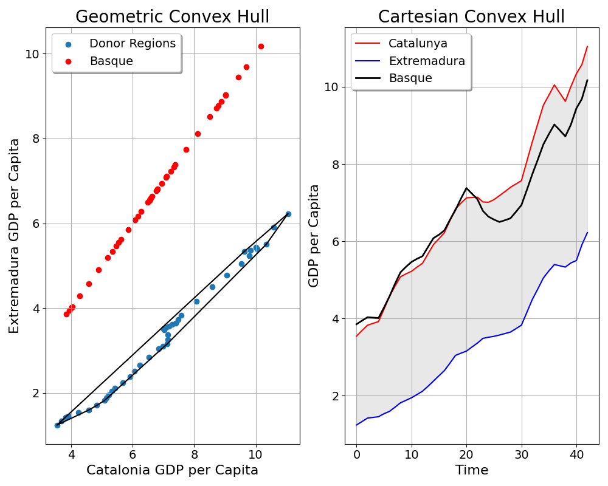

A Tutorial on the [Two-Step](https://doi.org/10.1287/mnsc.2023.4878) Synthetic Control Method 
==============

***A Marketing Application***

**Author:** *Jared Greathouse*

# Introduction
This tutorial uses publicly available data to demonstrate the utility of the [Two-Step](https://doi.org/10.1287/mnsc.2023.4878) Synthetic Control Method (TSSCM). The Python code is based on MATLAB code by [Kathleen Li](https://sites.utexas.edu/kathleenli/). The tutorial is also intended to give social scientists a more precise idea of the parallel trends assumptions underlying difference-in-differences (DID) and SCM, as these designs are increasingly popular for policy analysts, economists, marketers, and other fields. As a sort of prerequisite, I presumse that the reader is familiar with the basics of causal inference as well as the estimation of these designs. I begin with the mathematical preliminaries:
# Model Primitives
Here, we have $\mathcal{N} \coloneqq \lbrace{1 \ldots N \rbrace}$ units across $t \in \left(1, T\right) \cap \mathbb{N}$ time periods, where $j=1$ is our sole treated unit. This leaves us with $\mathcal{N}\_{0} \coloneqq \lbrace{2 \ldots N\rbrace}$ control units, with the cardinality of this set being the number of controls. We have two sets of time series $\mathcal{T}\coloneqq \mathcal{T}\_{0} \cup \mathcal{T}\_{1}$, where $\mathcal{T}\_{0}\coloneqq  \lbrace{1\ldots T_0 \rbrace}$ is the pre-intervention period and $\mathcal{T}\_{1}\coloneqq \lbrace{T_0+1\ldots T \rbrace}$ denotes the post-intervention period. Let $\mathbf{w}$ be a generic weight vector that is assigned to some donor units. We observe
```math
\begin{equation*}
y_{jt} = 
\begin{cases}
    y^{0}_{jt} & \forall \: j\in \mathcal{N}_0\\
    y^{0}_{1t} & \text{if } j = 1 \text{ and } t \in \mathcal{T}_0 \\
    y^{1}_{1t} & \text{if } j = 1 \text{ and } t \in \mathcal{T}_1
\end{cases}

\end{equation*}
```
We have a single treated unit which along with the donors follows a certain data generating process for all time periods before $T_0$. Afterwards, the control units follow the same process (assuming no spillovers), and the change of the outcomes for the treated unit is whatever that process was, plus some treatment effect. Accordingly, we may estimate DID as
```math
\begin{align}
    (\hat{\mu},\hat{w}) = \underset{\mu,w}{\text{arg\,min}} & \quad (\mathbf{y}_{1} - \mu -\mathbf{w}^\top -\mathbf{Y}_{\mathcal{N}_{0}})^\top (\mathbf{y}_{1} - \mu -\mathbf{w}^\top -\mathbf{Y}_{\mathcal{N}_{0}}) \\
    \text{s.t.} & \quad \mathbf{w}= N^{-1}_{0} \\
    & \mu = \frac{1}{T_0}\sum_{t=1}^{T_0}y_{1t} - \frac{1}{N_{0} \cdot T_0} \sum_{t=1}^{T_0}\sum_{j=2}^{N_0}y_{j \in \mathcal{N}_{0}}
\end{align}
```
While this may seem complicated, it is simple OLS. Here, we seek the line that minimizes the differences between the treated vector $\mathbf{y}\_{1}$ and the weighted average of controls $\mathbf{w}^\top -\mathbf{Y}\_{\mathcal{N}_{0}}$. There are constraints placed on the weigths however, for DID. Here, they must be constant and add up to 1, or proportionality $\mathbf{w}= N^{-1}\_{0}$. This makes sense; in our intro to causal inference courses, we learn that DID posits that our counterfactual to the treated unit would be the average of our control units plus some intercept, $\mu$. Well, the only way we may have this is if we are implicitly giving every control unit as much as weight as all of the other control units. This means that for objective causal inference, we must compare the treated unit to a set of controls that are as similar to the treated unit in every way but for the treatment. This leaves analysts with a few paths to take: we either discard dissimilar donors, or we adjust the weighting scheme for our units. As I've mentioned [elsewhere](https://github.com/jgreathouse9/FDIDTutorial/blob/main/Vignette.md), we may use methods such as forward selection to obtain the correct donor pool, under certain instances. In the case of DID, we may discard units.

SCM however has a different weighting scheme. In the SCM world, one of the primary innovations is that we are explicitly saying that the weights are not meant to be constant. Generically, we may express classic SCM as
```math
\begin{align}
    \underset{w}{\text{argmin}} & \quad ||\mathbf{y}_{1} - \mathbf{Y}_{\mathcal{N}_{0}}w_j||_{2}^2 \\
    \text{s.t.} & \mathbf{w}: w_{j} \in \mathbb{I} \quad  {\| \mathbf{w} \|_{1} = 1}
\end{align}
```
Where $\mathbb{I}$ is the unit interval. Much as above, the unit weights must also add up to 1. However in SCM, the weights may vary. This makes sense: SCM simply asks us to assume that some units matter more than others. In this case though, we ask the weights to lie on the convex hull.
## Interlude: Convex Hulls and Intercepts

> **Note**
>
> The idea of summation constraints and convex hulls has **direct implications** for the Two-Step Method. I pause here to give it a more extended discussion.
>
> 
Before I continue, I will be as precise as possible about what we mean when the convex hull condition is mentioned. Oftentimes it is invoked in econometrics, but it rarely explained in the simplest possible terms.

<p align="center">
  
</p>

Here I plot the GDP per Capita of the Spanish states from 1955 to 1997. The blue reference line denotes the onset of terrorist attacks in the Basque country in 1975. Suppose we wish to use DID to construct the counterfactual, or the GDP trends of the Basque Country had terrorism never happened. We will simply add an intercept plus the pre-intervention average of controls. In this setup, all units get the weight of $\frac{1}{16}$. But as we can see here, the Basque Country is kind of an outlier among the donors, with Madrid, Cataluna, and the Balearic Islands being the main competitors (in terms of pre-1975 levels) of GDPs per Capita. Here is an *explicit* illustration of the convex hull restriction, using only two donors.

<p align="center">
  
</p>

Suppose now we wish to construct a synthetic control for the Basque, using only Catalunya and Extremadura (index them respectively as the second and third units). 

```math
\begin{align}
    (\mathbf{w}) = \underset{w_{2},w_{3}}{\text{arg\,min}} & \quad (\mathbf{y}_{1} - w_2\mathbf{y}^{\text{CAT}}- w_3\mathbf{y}^{\text{EXT}})^{2} \:\forall \: t \in \mathcal{T}_1.
\end{align}
```

From earlier, recall that our weight vector $\mathbf{w} \coloneqq \lbrace{w_2 \ldots w_N  \rbrace}$ is simply a collection of scalar values determined by OLS. They serve as the coefficients of importance for our donors. Precisely, we multiply our donor units by these weights. The counterfactual here for vanilla SCM is just $\mathbf{y}^{\text{SCM}}=w_2\mathbf{y}^{\text{CAT}} + w_3\mathbf{y}^{\text{EXT}}$. To illustrate this, suppose $w_2=1$, meaning $w_3=0$. What does this mean for our counterfactual? Well, it just means that our counterfactual IS Catalunya. Why?  Let's plug it in to our formula for the counterfactual to verify this result. $\mathbf{y}^{\text{SCM}}=1\mathbf{y}^{\text{CAT}} + 0\mathbf{y}^{\text{EXT}}$. We know that anything multiplied by 1 is itself. The second term from the above optimization, $w_3\mathbf{y}^{\text{EXT}}$, simply vanishes when $w_3=0$. The reverse is true for Extremadura, where the coutnerfactual simply IS Extremadura if its weight is 1. So, the convex hull is actually better thought of as a constraint on our counterfactual overall. Because of Jensen's Inequality (the idea that the output of our function at the average input is less than or equal to the function at the average of our ouputs), the convex hull restriction, in the simplest of terms, says "Our counterfactual will not be greater than the maximum value of the donor pool, or lower than the minimum value of the donor pool. We, in effect, are *constraining* our counterfactual predictions to lie within a certain range of outcomes. This idea is easily extended to higher dimensions, and is also why we drop donors we think are irrelevant before estimating the counterfactual, typically, since including them in the pool risks interpolation biases induced by non-linearities of our control group relative to the treated unit. Imagine if above the optimal solution were $w_2 =.3$ and $w_3=.7$. Our counterfactual would massively undershoot that of the Basque Country, because Extremadura is simply too dissimilar to the Basque Country.

Note here that even if we were to assign a weight of 1 to Catalunya, it still would not fit as closely with the Basque Country as perhaps we'd like (indeed from [the original paper](https://www.aeaweb.org/articles?id=10.1257/000282803321455188), Madrid (a wealthier region than the Basque Country) and Catalunya received weight. This means, analytically, we have two options. Either we can add an intercept (say $\mu$, which simply shifts the counterfactual vertically depending on the sign), or we can allow the summation of weights to be greater than 1 (or we could do both).

# Two Step Synthetic Controls
We may have different SCMs however. After all, we are the econometricians, we are the ones who have say over what objectuve functions we optimize. With the idea of the intercept, we can restate classic SCM from above 
```math
\begin{align}
    \underset{w}{\text{argmin}} & \quad ||\mathbf{y}_{1} - \mathbf{Y}_{\mathcal{N}_{0}}w_j||_{2}^2 \\
    \text{s.t.} & \mathbf{w}: w_{j} \in \mathbb{I} \quad  {\| \mathbf{w} \|_{1} = 1} \quad \mu = 0
\end{align}
```
Consider three modifications.

```math
\begin{align}
    \underset{w}{\text{argmin}} & \quad ||\mathbf{y}_{1} - \mathbf{Y}_{\mathcal{N}_{0}}w_j||_{2}^2 \\
    \text{s.t.} & \mathbf{w}: w_{j} \in \mathbb{I} \quad  {\| \mathbf{w} \|_{1} = 1} \quad \mu \neq 0
\end{align}
```
