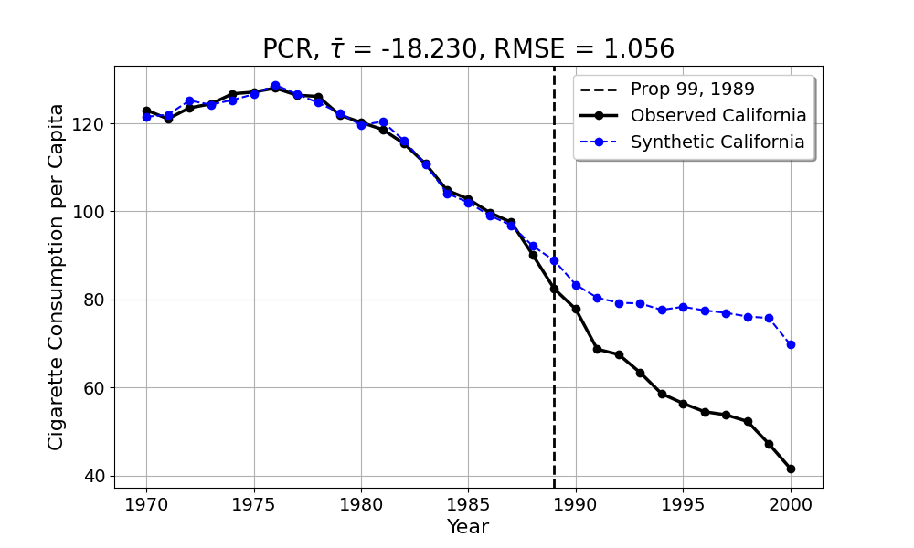
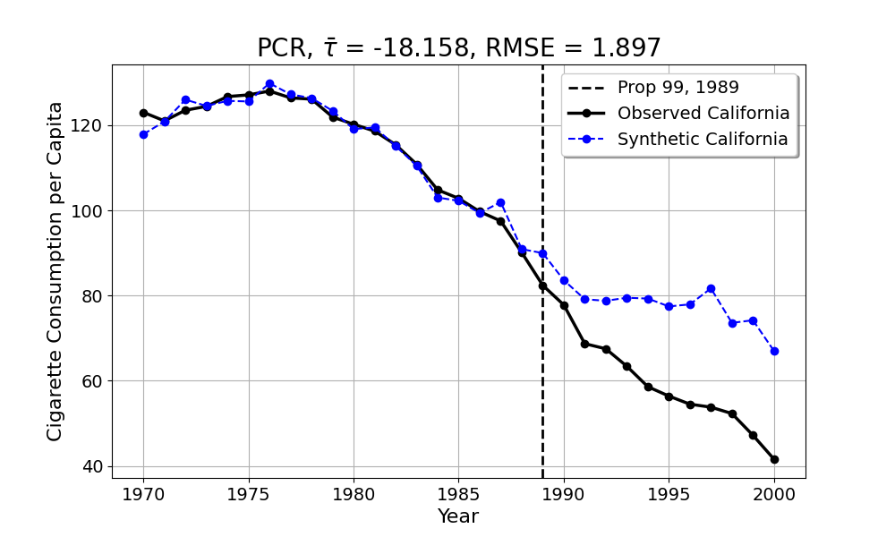
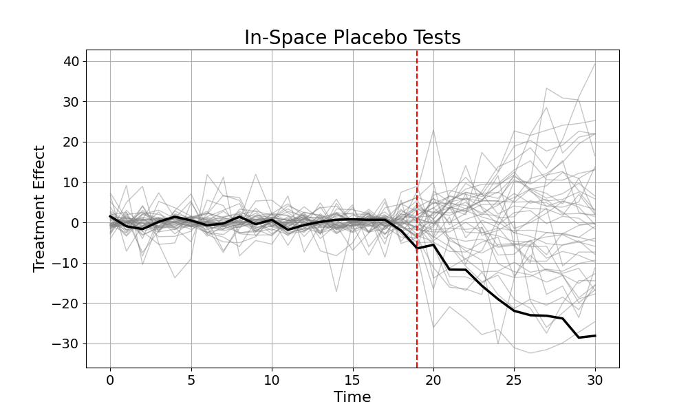

A Short Tutorial on [Principal Component Regression](https://doi.org/10.1080/01621459.2021.1928513) for Synthetic Controls 
==============

**Author:** *Jared Greathouse*

> [!IMPORTANT]
> **mlsynth** is an ongoing project; any feedback or comments are most welcome!

# Introduction
This tutorial uses publicly available data to demonstrate the utility of Principal Component Regression (PCR). As a sort of prerequisite, I presume that the reader is familiar with synthetic control methods (SCM). Precisely, I show how we may use the syntax to estimate the causal impact of interventions.
# Model Primitives
Here, we have $\mathcal{N} \coloneqq \lbrace{1 \ldots N \rbrace}$ units across $t \in \left(1, T\right) \cap \mathbb{N}$ time periods, where $j=1$ is our sole treated unit. This leaves us with $\mathcal{N}\_{0} \coloneqq \lbrace{2 \ldots N\rbrace}$ control units, with the cardinality of this set being the number of controls. We have two sets of time series $\mathcal{T}\coloneqq \mathcal{T}\_{0} \cup \mathcal{T}\_{1}$, where $\mathcal{T}\_{0}\coloneqq  \lbrace{1\ldots T_0 \rbrace}$ is the pre-intervention period and $\mathcal{T}\_{1}\coloneqq \lbrace{T_0+1\ldots T \rbrace}$ denotes the post-intervention period, each with their respective cardinalities. Let $\mathbf{w} \coloneqq \lbrace{w_2 \ldots w\_N  \rbrace}$ be a generic weight vector we assign to untreated units. We observe
```math
\begin{equation*}
y_{jt} = 
\begin{cases}
    y^{0}_{jt} & \forall \: j\in \mathcal{N}_0\\
    y^{0}_{1t} & \text{if } j = 1 \text{ and } t \in \mathcal{T}_0 \\
    y^{1}_{1t} & \text{if } j = 1 \text{ and } t \in \mathcal{T}_1
\end{cases}

\end{equation*}
```
We have a single treated unit which, along with the donors, follows a certain data generating process for all time periods until $T_0$. Afterwards, the control units follow the same process. The change of the outcomes $j=1,  \forall t \in \mathcal{T}_1$ is whatever that process was, plus some treatment effect.  To this end, we are concerned with $\hat{y}\_{j1}$, or the values we would have observed absent treatment. The statistic we are concerned with is the average treatment effect on the treated

$$ ATT = \frac{1}{T\_1 - T\_0} \sum_{T\_0 +1}^{T} (y_{1t} - \hat{y}_{1t}) $$

where $(y_{1t} - \hat{y}_{1t})$ is the treatment effect. In SCM, we exploit the cross-sectional linear relation between untreated units and the target/treated unit to estimate the counterfactual for a given intervention. That is, as some [researchers](https://doi.org/10.3982/ECTA21248) have succinctly said, "similar units behave similarly".
## SCM and SVD
Normal SCM is estimated like
```math
\begin{align}
    \underset{w}{\text{argmin}} & \quad ||\mathbf{y}_{1} - \mathbf{Y}_{\mathcal{N}_{0}}w_j||_{2}^2 \\
    \text{s.t.} & \mathbf{w}: w_{j} \in \mathbb{I} \quad  {\| \mathbf{w} \|_{1} = 1}
\end{align}
```
where the treated unit is projected on to the convex hull of the donor pool. [Elsewhere](https://github.com/jgreathouse9/mlsynth/blob/main/Vignettes/TSSC/TSSCVignette.md), I've discusssed the convex hull idea and why it matters to SCM. However, this may break down in settings where we have noisy outcome trends; in such settings, the units we match to may be idiosyncratically similar to the treated unit instead of being actually similar on latent factors. One key feature of real datasets in economics, policy, marketing, and statistics is that datasets are most often noisily observed. We mean "noisily" observed in the sense that we do not see the real data generating process. Oftentimes, a variety of factors will influence the values GDP will take on for a given time point. Thus, researchers benefit from having a causal estimator that can adjust for noise and debias our estimates. Precisely, we use a linear algebra technique called singular value decomposition (SVD) to denoise our donor matrix of outcomes
```math
\mathbf{L} \coloneqq \mathbf{Y}=\mathbf{U}\mathbf{S}\mathbf{V}^{\top}
```
where $\mathbf{L}$ is our low-dimensional representation of our pre-intervention outcomes. $\mathbf L$ has as many columns as we have donors. I do not wish to reinvent wheels, so to those who do not rememeber/haven't learned SVD/PCA, [others](https://www.youtube.com/watch?v=FgakZw6K1QQ) have explained SVD a lot simpler than they do in class/textbooks. The basic idea is that we wish to find a simplified, low-dimensional representation of our donor matrix and use that to explain the pre-intervention variation of our treatment unit. The low-dimensional (also called low rank) representation of our donors allows us to first *learn* the pre-intervention observed time-series for for our treated unit. Using this learnt pre-intervention estimates, we may then predict the post-intervention counterfactual outcomes based on the pre-intervention estimates.

In SVD, we have as many singular values as we do variables (38 in the below example). However, we ideally do not wish to use all of them. Typically, we wish to use the least amount of singular values that has the maximum explanatory power with respect to the pre-intervention variance. In the first place, this is what is meant by a low-rank hypothesis, the idea that we can use simplified versions of an observed data matrix which are also informative enough to make predictions about. In grad school, they teach us to use screeplots and elbow method to select the number of principal componenets/singular values; however, this leaves our results to be quite subjective because the number of principal components we use directly affect the results we get. In order to select the optimal amount of singular values for regression, I employ [Universal Singular Value Thresholding](https://doi.org/10.1214/14-AOS1272) to shave off the irrelevant singular values. In other words, if we use too many principal components/singular values, we will overfit the pre-intervention time series of the treated unit, much as OLS is apt to do. If we use too few, we will underfit (and thus, have worse our of sample predictions). Other methods have been [proposed](https://ieeexplore.ieee.org/abstract/document/6846297), but this is what the original authors use, so I use it as well. The final regression model we use is
```math
\begin{align}
    \underset{w}{\text{argmin}} & \quad ||\mathbf{y}_{1} - \mathbf{L} w_j||_{2}^2 \\
    \text{s.t.} \: & \mathbf{w}: w_{j} \in \mathbb{R}
\end{align}
```
where the weights may be any value on the real line. The $\mathbf L$ matrix in this optimization, as I mentioned above, is truncated by the USVT method.
# Empirical Example: Proposition 99
Let's replicate the Proposition 99 example, the classic SCM case study.

<table>
  <tr>
    <th>Importing</th>
    <th>Estimation</th>
  </tr>
  <tr>
    <td>
    <pre><code>
import pandas as pd
from mlsynth.mlsynth import PCR
import matplotlib
# matplotlib theme
jared_theme = {'axes.grid': True,
              'grid.linestyle': '-',
              'legend.framealpha': 1,
              'legend.facecolor': 'white',
              'legend.shadow': True,
              'legend.fontsize': 14,
              'legend.title_fontsize': 16,
              'xtick.labelsize': 14,
              'ytick.labelsize': 14,
              'axes.labelsize': 16,
              'axes.titlesize': 20,
              'figure.dpi': 100,
               'axes.facecolor': 'white',
               'figure.figsize': (10, 8)}

matplotlib.rcParams.update(jared_theme)

unitid = "State"
time = "Year"
outcome = "Cigarette Consumption per Capita"
treat = "Prop 99"

file = 'https://raw.githubusercontent.com/synth-inference/synthdid/master/data/california_prop99.csv'
df = pd.read_csv(file, sep=';')

df = df.rename(columns={'year': 'Year', 
'treated': 'Prop 99', 
'PacksPerCapita': 'Cigarette Consumption per Capita'})

df.sort_values(by=["State", "Year"], ascending=True)
    </pre></code>
    </td>
    <td>
    <pre><code>
model = PCR(
    df=df,
    treat=treat,
    time=time,
    outcome=outcome,
    unitid=unitid,
    figsize=(10, 8),
    grid=True,
    treated_color='black',
    counterfactual_color='blue',
    display_graphs=True, objective="OLS")

autores = model.fit()
    </pre></code>
    </td>
  </tr>
</table>

Here we import the data from the synthdid github repo. I used it because it already has the requirements that any **mlsynth** package needs, that is, a unit, time, treatment dummy, and outcome variable. We define them accordingly and pass them to the PCR class. Now we can estimate the model. And here is the plot of our results.

<p align="center">
  
</p>

The plot shows the observed values of the treated unit, California, and the counterfactual estimates for California. With the optimal threshold of 5 singular values, we see a high fidelity between the counterfactual predictions before 1989 (the first full year that Prop 99 was active for) and the real California. In the post-intervention period, we see Prop 99 decreased the amount of cigarettes per pack smoked between California and its counterfactual, an average difference of 18.23. Notice how we used unconstrained OLS to compute the unit weights. The practical effect of this is that every donor gets weight. However, we can [also, as Dennis Shen suggested in his master's thesis](https://core.ac.uk/download/pdf/158415279.pdf), add Convex Hull constraints to the objective function, for a more sparse/interpretable solution. We do this by changing OLS to "SC".

<p align="center">
  
</p>

The unit weights we get with Convex PCR are Connecticut: 0.1168, Nevada: 0.1327, New Hampshire: 0.1469, Utah: 0.6017, Wyoming: 0.0019. We get slightly less fit, but as we can see, we shouldn't care. The fit is still so similar and the practical conclusions are not changed very much. We can also do in-spalce placebo tests, where we reassign the treatment to all donors and estimate their respective synthetic controls. Since California is treated, we drop it from the donor pool of the in-space placebo tests.

<details>
    
  <summary>Doing in-space placebos...</summary>
  
```python
model = PCR(
    df=df,
    treat=treat,
    time=time,
    outcome=outcome,
    unitid=unitid,
    figsize=(10, 6),
    grid=True,
    treated_color='black',
    counterfactual_color='blue',
    display_graphs=True, objective="OLS", save=True, placebo="Unit")
```

</details>

> [!IMPORTANT]
> I'm aware the the in-space placebo plot could be better labeled (with a legend and such). I am also aware that we can do the p-value inference which ranks the post to pre ratios, making bar plots to show how extreme the deviation is with respect to the pre-period fit.  These functionalities will come. 

<p align="center">
  
</p>

We see that California (estimated with unconstrained OLS instead of Convex PCR) has the most extreme deviation in the post-intervention period compared to its donors (it has the second/third most deviation when we use the Convex Hull). This is also confirmed by looking at the post to preintervention RMSE ratio, which is returned in a dictionary if the user specified ```placebo="Unit"```. Another thing I would like to highlight is how we get very similar to the original results of Abadie's 2010 paper, while also not needing to incorporate any covariates in the analysis. This is another benefit of the denoising algorithm as discussed in [Amjad, Shah, and Shen, 2018](https://www.jmlr.org/papers/volume19/17-777/17-777.pdf). I would also like to note that there's a cousin estimator to PCR called [multidimensional Robust SCM](https://doi.org/10.1145/3341617.3326152) which does incorporate additional metrics. Perhaps I will incorporate this into **mlsynth** in the future, but this estimator here tends to do as good as normal SCM if not better, assuming we have a long enough pre-intervention period.

# Conclusion

PCR facilitates the estimation of synthetic control method treatment effects. I illustrate how the simple denoising algorithm applied to the donors can get very similar fit as well as practical conclusion to the original SC estimator without needing to rely on predictors. There are, however, a few caveats: PCR in its current iteration is not robust to outliers! PCA/SVD like methods perform poorly in such settings. As a result, [other methods](https://academicworks.cuny.edu/cgi/viewcontent.cgi?article=6069&context=gc_etds) have been developed to attenuate for this issue, such as Robust PCA methods. This estimator, developed by my friend and coworked Mani Bayani, will be the subject of subsequent tutorials.

# Contact
- Jared Greathouse: <jgreathouse3@student.gsu.edu>

